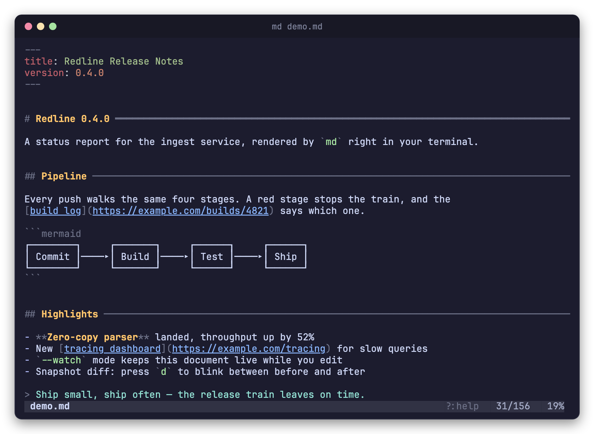
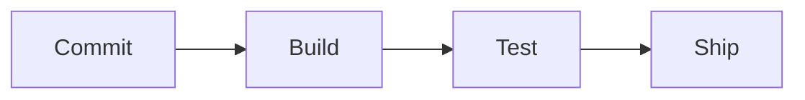
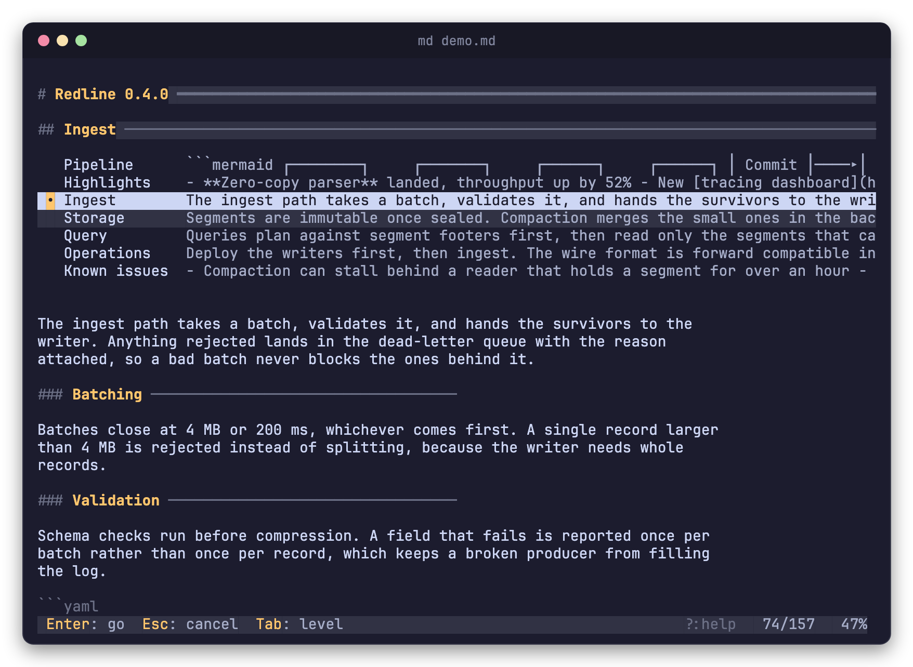
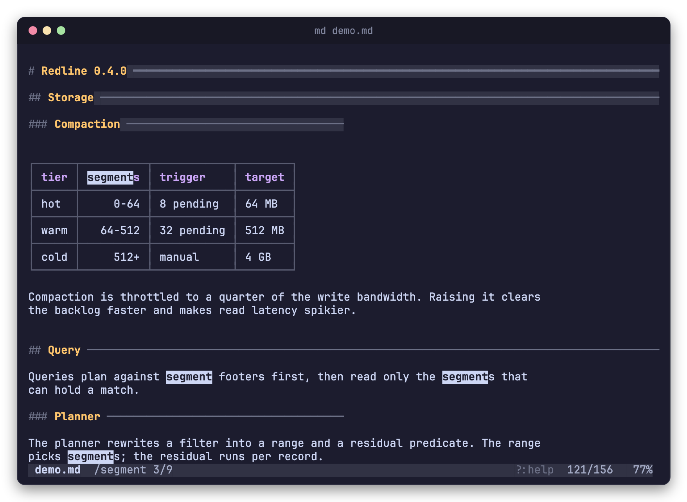
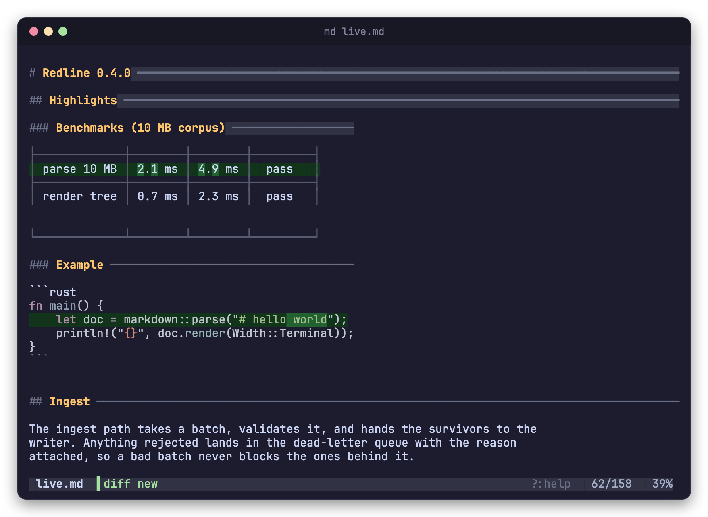

<h1 align="center">md</h1>

<p align="center">
A Markdown pager for the terminal — syntax highlighting, box-drawn tables,
Mermaid diagrams as text, sticky headings, live reload, and a blinking snapshot
diff.
</p>

<p align="center">

</p>

<details>
<summary>The Markdown behind the screen above</summary>

````markdown
---
title: Redline Release Notes
version: 0.4.0
---

# Redline 0.4.0

A status report for the ingest service, rendered by `md` right in your terminal.

## Pipeline

Every push walks the same four stages. A red stage stops the train, and the
[build log](https://example.com/builds/4821) says which one.



## Highlights

- **Zero-copy parser** landed, throughput up by 52%
- New [tracing dashboard](https://example.com/tracing) for slow queries
- `--watch` mode keeps this document live while you edit
- Snapshot diff: press `d` to blink between before and after

> Ship small, ship often — the release train leaves on time.
````

</details>

## Features

- **Headings you can navigate by eye** — h1 and h2 draw a rule out to the
  terminal edge (heavy and light), h3 to half width; gold fades out below h3,
  and h1/h2 get extra vertical padding, so document structure survives fast
  scrolling.
- **Headings that stay on screen** — the h1–h3 chain around what you are
  reading sits above the body, so you always know where you are.
- **Jump between sections** — `Tab`, or a click on any heading, lists the
  sections beside the one you are reading, each with the start of its text in a
  second column.
- **Tables as tables** — GFM pipe tables become box-drawing grids with column
  alignment and cell wrapping.
- **Code that looks like code** — fenced blocks are highlighted with
  [syntect](https://github.com/trishume/syntect); YAML frontmatter too. Long
  lines are never wrapped — scroll horizontally instead.
- **Mermaid without a browser** — ` ```mermaid ` blocks are rendered as
  Unicode diagrams via
  [mermaid-text](https://crates.io/crates/mermaid-text).
- **A real pager** — less-style keys, case-insensitive search with match
  highlighting and a hit counter, horizontal scrolling. The status bar names
  only the state that differs from the default, and `?` shows the key list.
- **Live reload** — `--watch` re-reads the file every 250 ms and skips
  half-written intermediate states.
- **Snapshot diff** — pin the current state, edit the file, and blink
  between before and after with changed words highlighted.

Colors are 24-bit RGB (a Catppuccin-Mocha-flavored palette tuned for dark
backgrounds), so a truecolor terminal is expected.

## Install

Requires Rust 1.92 or later.

```sh
cargo install --path .
```

## Usage

```sh
md README.md          # open a file
md --watch notes.md   # open and live-reload on change
```

### Keys

| Key | Action |
| --- | --- |
| `j` / `k`, `↓` / `↑`, `e` / `y` | Scroll one line |
| Wheel | Scroll three lines |
| `f` / `b`, `PgDn` / `PgUp` | Scroll one page |
| `g` / `G` | Jump to top / bottom |
| `Tab` / `Shift`+`Tab` | Open the section menu at the deepest / top level |
| Click a heading | Open the section menu for that heading |
| `h` / `l`, `←` / `→` | Scroll 4 columns |
| `H` / `L`, `Shift`+`←` / `→` | Scroll half a screen width |
| `0` | Back to the first column |
| `/` | Search (`Enter` to run, `Esc` to cancel) |
| `n` / `N` | Next / previous match |
| `r` | Reload the file now |
| `w` | Toggle watch mode |
| `s` | Take or discard a snapshot |
| `d` | Cycle diff view: current ⇄ snapshot |
| `Esc` | Leave diff view |
| `?` | Show this list (any key closes it) |
| `q` | Quit |

The pager holds the mouse while it runs, so selecting text with the pointer
needs `Shift` (`Option` in macOS Terminal.app and iTerm2).

## Sticky headings

The h1–h3 that contain the top of the screen stay pinned above the body on a
tinted band. On a terminal short enough that the band would take half the
height, the shallowest levels are dropped first — the nearest heading is the one
worth keeping.

Scrolling redraws only the rows that moved, so the pinned headings do not
flicker as the body slides under them.

## Section menu

<p align="center">

</p>

`Tab` lists the siblings of the heading at the bottom of the sticky header —
the sections next to the one you are reading. `Shift`+`Tab` starts at the top
level instead, and once the list is open both keys walk the chain of levels.

Every entry carries the start of its section in its own column: the first text
under the heading, running on through the subsections below it so a section that
opens with a subheading still shows something. Titles are measured across the
whole list, including entries outside the window, so paging through does not
shift the preview column.

The list shows up to ten entries at a time and opens with the selection near the
middle, so you can see how far the siblings run in each direction. `↑` `↓` (or
`k` `j`) move the selection, the wheel scrolls the list itself, and `Enter` goes
to the selected section. `Esc` returns to where you opened the list, and a dot
marks the section you came from. Other keys do nothing while the list is open.

Clicking a heading opens the list for it; clicking that heading again closes
it. From the sticky header the list hangs underneath, and the body follows the
selection as you move so you can read a section before choosing it. From a
heading in the body the list opens right there — under the line, or above it
when the bottom of the screen is close — and the body holds still until you
pick an entry.

## Search

<p align="center">

</p>

`/` types a query into the status bar, which changes color while you edit it.
Matching is case-insensitive and every match on screen is drawn in reverse,
including matches inside the sticky headings. `n` and `N` walk the hits and the
status bar keeps the count; a query that matches nothing says so instead.

## Snapshot diff

<p align="center">

</p>

Press `s` to pin the current document as the baseline, keep editing the file,
then press `d`: the current rendering appears with changed lines tinted green
and changed words emphasized. Press `d` again to flip to the snapshot layer,
tinted red.

Unchanged lines occupy the same row in both layers, and a line that exists in
only one layer leaves a colored filler row in the other — so holding down `d`
blinks exactly the parts that changed while everything else stands still.
`Esc` returns to the normal view.

The sticky header follows the layer on screen, so a renamed heading blinks with
the body. Both layers reserve the same header height, so adding or removing a
heading never shifts the rows under it.

## Watch mode

Start with `--watch` (or toggle with `w`). The file is re-read every 250 ms:

- A file that keeps changing between polls is treated as still being written;
  it is shown once two consecutive reads agree, or after one second at the
  latest.
- If a read fails, the last good render stays on screen and the status bar
  shows the error; watching resumes automatically once the file is readable.
- Enabling watch takes a snapshot of the current state if none exists, so `d`
  can always show what changed since you started watching.
- `r` bypasses the polling cycle and the stability wait, reloading on the
  spot.
