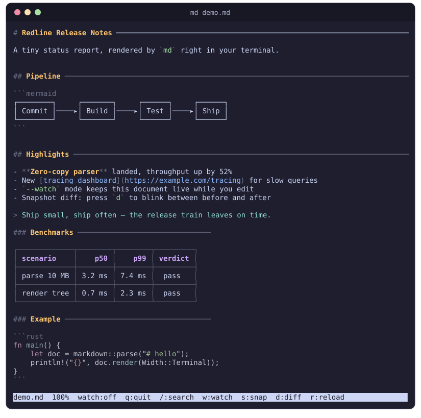
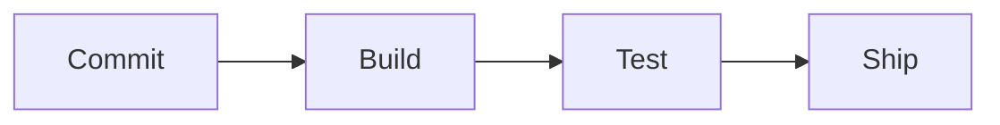

<h1 align="center">md</h1>

<p align="center">
A Markdown pager for the terminal — syntax highlighting, box-drawn tables,
Mermaid diagrams as text, live reload, and a blinking snapshot diff.
</p>

<p align="center">

</p>

<details>
<summary>The Markdown behind this screen</summary>

````markdown
# Redline Release Notes

A tiny status report, rendered by `md` right in your terminal.

## Pipeline



## Highlights

- **Zero-copy parser** landed, throughput up by 52%
- New [tracing dashboard](https://example.com/tracing) for slow queries
- `--watch` mode keeps this document live while you edit
- Snapshot diff: press `d` to blink between before and after

> Ship small, ship often — the release train leaves on time.

### Benchmarks

| scenario | p50 | p99 | verdict |
| --- | ---: | ---: | :---: |
| parse 10 MB | 3.2 ms | 7.4 ms | pass |
| render tree | 0.7 ms | 2.3 ms | pass |

### Example

```rust
fn main() {
    let doc = markdown::parse("# hello");
    println!("{}", doc.render(Width::Terminal));
}
```
````

</details>

## Features

- **Headings you can navigate by eye** — h1 and h2 draw a rule out to the
  terminal edge (heavy and light), h3 to half width; gold fades out below h3,
  and h1/h2 get extra vertical padding, so document structure survives fast
  scrolling.
- **Tables as tables** — GFM pipe tables become box-drawing grids with column
  alignment and cell wrapping.
- **Code that looks like code** — fenced blocks are highlighted with
  [syntect](https://github.com/trishume/syntect); YAML frontmatter too. Long
  lines are never wrapped — scroll horizontally instead.
- **Mermaid without a browser** — ` ```mermaid ` blocks are rendered as
  Unicode diagrams via
  [mermaid-text](https://crates.io/crates/mermaid-text).
- **A real pager** — less-style keys, case-insensitive search with match
  highlighting, horizontal scrolling.
- **Live reload** — `--watch` re-reads the file every 250 ms and skips
  half-written intermediate states.
- **Snapshot diff** — pin the current state, edit the file, and blink
  between before and after with changed words highlighted.

Colors are 24-bit RGB (a Catppuccin-Mocha-flavored palette tuned for dark
backgrounds), so a truecolor terminal is expected.

## Install

Requires Rust 1.92 or later.

```sh
cargo install --path .
```

## Usage

```sh
md README.md          # open a file
md --watch notes.md   # open and live-reload on change
```

### Keys

| Key | Action |
| --- | --- |
| `j` / `k`, `↓` / `↑`, `e` / `y` | Scroll one line |
| `f` / `b`, `PgDn` / `PgUp` | Scroll one page |
| `g` / `G` | Jump to top / bottom |
| `h` / `l`, `←` / `→` | Scroll 4 columns |
| `H` / `L`, `Shift`+`←` / `→` | Scroll half a screen width |
| `0` | Back to the first column |
| `/` | Search (`Enter` to run, `Esc` to cancel) |
| `n` / `N` | Next / previous match |
| `r` | Reload the file now |
| `w` | Toggle watch mode |
| `s` | Take or discard a snapshot |
| `d` | Cycle diff view: current ⇄ snapshot |
| `Esc` | Leave diff view |
| `q` | Quit |

## Snapshot diff

<p align="center">

</p>

Press `s` to pin the current document as the baseline, keep editing the file,
then press `d`: the current rendering appears with changed lines tinted green
and changed words emphasized. Press `d` again to flip to the snapshot layer,
tinted red.

Unchanged lines occupy the same row in both layers, and a line that exists in
only one layer leaves a colored filler row in the other — so holding down `d`
blinks exactly the parts that changed while everything else stands still.
`Esc` returns to the normal view.

## Watch mode

Start with `--watch` (or toggle with `w`). The file is re-read every 250 ms:

- A file that keeps changing between polls is treated as still being written;
  it is shown once two consecutive reads agree, or after one second at the
  latest.
- If a read fails, the last good render stays on screen and the status bar
  shows the error; watching resumes automatically once the file is readable.
- Enabling watch takes a snapshot of the current state if none exists, so `d`
  can always show what changed since you started watching.
- `r` bypasses the polling cycle and the stability wait, reloading on the
  spot.
